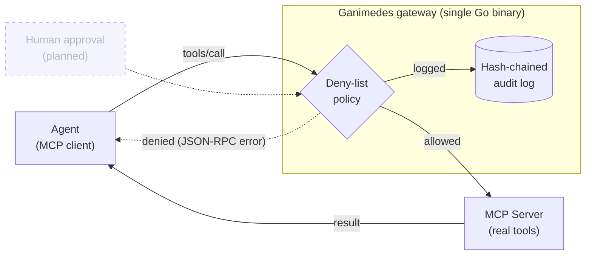

	

  

> The control and security layer for autonomous AI agents.
> We secure what AI agents **do**, not just what they know.

AI agents can now read data, call APIs, move money, deploy code, and take real
actions inside company systems. They are getting autonomy faster than anyone can
control it. Traditional security protects data, endpoints, and human identities.
Ganimedes protects a new entity: the autonomous agent that has an identity,
permissions, tools, and the power to execute actions.

Ganimedes sits between your agents and your systems, and answers four questions
about every action an agent takes:

- **WHO** is the agent? (identity)
- What **CAN** it do? (capabilities)
- What **SHOULD** it do right now? (policy and risk)
- Can we **PROVE** what it did? (verifiable audit)

In v0 that is one small gateway wrapping a single MCP server: allowed calls are
forwarded, denied ones are blocked with an error, and every call is written to a
tamper-evident log.

## Status

Early. Work in progress. v0 does **one thing well** instead of ten things badly.

## v0 scope

A lightweight **MCP gateway** you drop between an AI agent and its MCP tools.
It does three things, and nothing more:

1. **Tamper-evident audit.** Every tool call (arguments and result) is recorded
   in a hash-chained log, so you can answer "what did my agent actually do?" and
   prove the log was not altered after the fact.
2. **Deny-list policy.** Simple JSON rules. Block `payment.execute` and
   `database.delete`, allow the rest. Deterministic, readable, no surprises.
3. **Human-in-the-loop.** Flagged tools pause and require explicit approval
   before they run. Deterministic rules, no ML.

If you are a developer building an agent, this is useful on day one, even if all
you ever use is the audit log.

## Explicitly NOT in v0

Multi-level identity, ML-based risk scoring, dashboards, blockchain anchoring,
pricing tiers, hosted SaaS. All of that comes later, and only if real users ask
for it. Building those now would be building what nobody requested.

## The bigger picture

The v0 gateway is the seed of a larger control plane. The roadmap follows the
same four pillars, each earned by real adoption before it is built:

| Pillar     | Question                        | v0            | Later                          |
|------------|---------------------------------|---------------|--------------------------------|
| Identity   | Who is the agent?               | -             | Agent identity and ownership   |
| Capability | What can it do?                 | Deny-list     | Fine-grained capabilities      |
| Policy     | What should it do right now?    | JSON rules    | Policy engine + risk scoring   |
| Proof      | Can we prove what it did?       | Hash-chain    | Verifiable audit trail         |

## Stack

| Layer          | Choice                                              | Status  |
|----------------|------------------------------------------------------|---------|
| Language       | Go 1.22+                                              | in use  |
| Dependencies   | none (standard library only)                          | in use  |
| MCP transport  | stdio, JSON-RPC 2.0, newline-delimited JSON           | in use  |
| CLI            | hand-rolled subcommands, no framework                 | in use  |
| Packaging      | `go build` -> single static binary, no runtime needed | in use  |
| Config format  | JSON                                                  | in use  |
| Audit log      | JSONL file, SHA-256 hash chain                        | in use  |
| Audit signing  | RFC 8785 canonical JSON + Ed25519 signatures          | planned |
| Approval UI    | minimal HTML page served on localhost via `net/http`  | planned |

No frontend framework: the only UI is a small local approval page served
directly by the Go binary. Everything else is a CLI/proxy with no screen.

See [docs/DESIGN.md](docs/DESIGN.md) for the full technical design and build
order.

## License

To be defined before the repository goes public.
