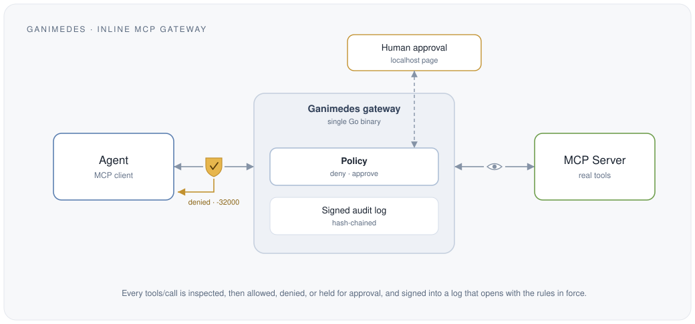

<p align="center">
  
  &nbsp;
  
</p>

> The governance and security layer for autonomous AI agents.
> Control and prove what AI agents **do**, not just what they know.

AI agents can now read data, call APIs, move money, deploy code, and take real
actions inside company systems. They are getting autonomy faster than anyone can
control it. Traditional security protects data, endpoints, and human identities.
Ganimedes protects a new entity: the autonomous agent that has an identity,
permissions, tools, and the power to execute actions.

Ganimedes sits between your agents and your systems, and answers four questions
about every action an agent takes:

- **WHO** is the agent? (identity)
- What **CAN** it do? (capabilities)
- What **SHOULD** it do right now? (policy and risk)
- Can we **PROVE** what it did? (verifiable audit)

In v0 that is one small gateway wrapping a single MCP server: allowed calls are
forwarded, denied ones are blocked with an error, flagged ones pause for human
approval on a local page, and every call is written to a tamper-evident log.

<p align="center">
  
</p>

## Governance for agents, not a sandbox

Ganimedes is **governance for AI agents**: know and prove what your agents did,
and block the calls they should not make. The tamper-evident audit log is the
core, and you can verify it offline; the deny-list and human approval are
lightweight, deterministic guardrails on top.

It sits at the MCP tool-call boundary. It is **not a sandbox**: it does not
isolate processes, patch vulnerabilities, or stop an attacker who already
controls the machine. It makes what an agent does **accountable and
controllable**, and it never claims a guarantee it does not enforce.

## Status

Early, and shipping. **`v0.2.0` is the current release**, published from a tagged
commit with checksums and a build provenance attestation on every binary. v0 does
**one thing well** instead of ten things badly, and everything it does is listed
below alongside what it deliberately does not do.

The published binaries are checked, not assumed: each one is verified against its
checksum and its attestation, and the release before this one was rebuilt from its
tagged commit to confirm it matched the source it claimed to come from. What that
audit found was not a bad binary but four places where this tool described itself
inaccurately, all fixed in `v0.2.0`.

## Quick start

### Install

Download the binary for your platform, and `SHA256SUMS`, from the [latest
release](https://github.com/Jegoba90/Ganimedes-Project/releases/latest). It is a
single static file with no runtime to install, but it arrives as an ordinary
download: named after its platform, without the execute bit, and not on your
PATH.

On Linux and macOS:

```sh
sha256sum -c SHA256SUMS --ignore-missing     # ganimedes_v0.2.0_linux_amd64: OK
chmod +x ganimedes_v0.2.0_linux_amd64
./ganimedes_v0.2.0_linux_amd64 version       # ganimedes v0.2.0
```

Substitute your platform for `linux_amd64`: `linux_arm64`, `darwin_amd64` or
`darwin_arm64`. Without the `chmod` the shell answers `Permission denied`: a
release asset arrives as a plain `rw-r--r--` file, execute bit and all being
something only you can grant it.

`--ignore-missing` is a GNU coreutils flag, and it is there because `SHA256SUMS`
lists all six binaries while you downloaded one. Where it does not exist (BusyBox
on Alpine, and macOS, which ships `shasum` instead), hash your file and compare
the line yourself:

```sh
shasum -a 256 ganimedes_v0.2.0_darwin_arm64
# compare with the matching line in SHA256SUMS
```

macOS also quarantines anything downloaded through a browser, and these binaries
are not notarized, so clear that attribute before the first run:

```sh
xattr -d com.apple.quarantine ganimedes_v0.2.0_darwin_arm64
```

The rest of this README calls the command `ganimedes`. To get that name, install
it onto your PATH, which sets the execute bit at the same time:

```sh
sudo install -m 755 ganimedes_v0.2.0_linux_amd64 /usr/local/bin/ganimedes
ganimedes version   # ganimedes v0.2.0
```

On Windows, PowerShell checks the hash (there is no `sha256sum`), and the file
runs as downloaded, with no permission to set:

```powershell
(Get-FileHash ganimedes_v0.2.0_windows_amd64.exe -Algorithm SHA256).Hash.ToLower()
# compare with the matching line in SHA256SUMS
.\ganimedes_v0.2.0_windows_amd64.exe version   # ganimedes v0.2.0
```

Windows may warn that the publisher is unrecognized: these binaries are not
code-signed, which is an open decision recorded in [INFRA.md](docs/INFRA.md) §3.
The checksum and the attestation below are what you check instead.

Those checksums sit on the same page as the binaries, so they prove the download
is intact, not where it came from. From `v0.2.0` on, each binary also carries a
build provenance attestation, which is checked against GitHub instead:

```sh
gh attestation verify ganimedes_v0.2.0_linux_amd64 --repo Jegoba90/Ganimedes-Project
```

With a Go toolchain you can skip the download entirely:

```sh
go install github.com/Jegoba90/Ganimedes-Project/cmd/ganimedes@latest
```

### Wrap a server

Ganimedes' own flags come first, then `--`, then the MCP server command to wrap.
Everything after `--` belongs to the server:

```sh
ganimedes run -- npx -y @modelcontextprotocol/server-filesystem ./data
```

Point your MCP client at that command instead of the server's own. Nothing
changes for the agent, because allowed calls are forwarded untouched. What
changes is that every `tools/call` is now recorded in `ganimedes-audit.jsonl`.
On first run the signing key is generated next to it:

```
run: generated a new signing key at "ganimedes-signing.key" (public key at "ganimedes-signing.pub")
```

### Prove what happened

```sh
ganimedes verify
# audit log OK: 2 entries, chain intact and signatures valid (ganimedes-audit.jsonl)
```

Change one entry by hand and this fails, naming the entry and what broke. Anyone
auditing you needs only the log and the public key, never the private one:

```sh
ganimedes verify --pubkey ganimedes-signing.pub ganimedes-audit.jsonl
```

### Block and approve

What is worth blocking depends on the server. `scan` lists the tools it exposes
and flags the risky ones. It reports only, and enforces nothing:

```sh
ganimedes scan -- npx -y @modelcontextprotocol/server-filesystem ./data
#   FLAG  write_file   matched: write, create
#   FLAG  edit_file    matched: edit
#   4 of 14 tool(s) flagged for review.
```

Then write the rules. `deny` blocks outright, `approve` holds the call until a
human decides:

```json
{
  "deny": ["move_file"],
  "approve": ["write_file", "edit_file"]
}
```

```sh
ganimedes run --config config.json -- npx -y @modelcontextprotocol/server-filesystem ./data
```

A denied call never reaches the server, and the agent gets the JSON-RPC error
`-32000`. A call that needs approval pauses and appears at
`http://127.0.0.1:8765` with its arguments, where you press Approve or Reject. If
nobody answers within `--approval-timeout` (60 seconds by default) the call is
refused: ambiguity always fails closed.

`ganimedes help` lists every command and flag.

## v0 scope

A lightweight **MCP gateway** you drop between an AI agent and its MCP tools.
It does three things, and nothing more:

1. **Tamper-evident audit.** Every tool call (arguments and result) is recorded
   in a hash-chained log, so you can answer "what did my agent actually do?" and
   prove the log was not altered after the fact.
2. **Deny-list policy.** Simple JSON rules. Block `payment.execute` and
   `database.delete`, allow the rest. Deterministic, readable, no surprises.
3. **Human-in-the-loop.** Flagged tools pause and require explicit approval
   before they run. Deterministic rules, no ML.

If you are a developer building an agent, this is useful on day one, even if all
you ever use is the audit log.

## Explicitly NOT in v0

Multi-level identity, ML-based risk scoring, dashboards, blockchain anchoring,
pricing tiers, hosted SaaS. All of that comes later, and only if real users ask
for it. Building those now would be building what nobody requested.

## The bigger picture

The v0 gateway is the seed of a larger control plane. The roadmap follows the
same four pillars, each earned by real adoption before it is built:

| Pillar     | Question                        | v0            | Later                          |
|------------|---------------------------------|---------------|--------------------------------|
| Identity   | Who is the agent?               | -             | Agent identity and ownership   |
| Capability | What can it do?                 | Deny-list     | Fine-grained capabilities      |
| Policy     | What should it do right now?    | JSON rules    | Policy engine + risk scoring   |
| Proof      | Can we prove what it did?       | Signed, verifiable log | External anchoring     |

## Stack

| Layer          | Choice                                              | Status  |
|----------------|------------------------------------------------------|---------|
| Language       | Go 1.22+                                              | in use  |
| Dependencies   | none (standard library only)                          | in use  |
| MCP transport  | stdio, JSON-RPC 2.0, newline-delimited JSON           | in use  |
| CLI            | hand-rolled subcommands, no framework                 | in use  |
| Packaging      | `go build` -> single static binary, no runtime needed | in use  |
| Config format  | JSON                                                  | in use  |
| Audit log      | JSONL file, SHA-256 hash chain                        | in use  |
| Audit signing  | RFC 8785 canonical JSON + Ed25519 signatures          | in use  |
| Approval UI    | minimal HTML page served on localhost via `net/http`  | in use  |
| Releases       | tag-triggered GitHub Actions, 6 targets + `SHA256SUMS` | in use  |
| Provenance     | Sigstore build attestation, keyless, via GitHub Actions | in use  |

No frontend framework: the only UI is a small local approval page served
directly by the Go binary. Everything else is a CLI/proxy with no screen.

See [docs/DESIGN.md](docs/DESIGN.md) for the full technical design and build
order.

## Security

Found a way past the gateway? Report it privately through the [security
advisory form](https://github.com/Jegoba90/Ganimedes-Project/security/advisories/new)
rather than a public issue.

[SECURITY.md](SECURITY.md) says what counts as a vulnerability here, what a
one-person project can honestly promise about response times, and the limits
that are already known and written down rather than waiting to be discovered.
It also covers how to verify a download: every release carries checksums, and
releases from `v0.2.0` on carry a build provenance attestation, which proves the
binary came out of this repository's workflow without having to trust the page
you downloaded it from.

## License

[Apache License 2.0](LICENSE). Copyright 2026 Jegoba90.

Use it, fork it, embed it in a commercial product. Apache-2.0 was chosen over
MIT for the two clauses MIT lacks, and both matter for a tool you are asked to
put inside your agent's toolchain: an explicit patent grant, so adopting it
carries no patent ambiguity, and an explicit statement that the license grants
no trademark rights. Ganimedes has no third-party dependencies, so this single
license covers the whole work, code and assets alike, with no attribution
obligations inherited from anyone else.
