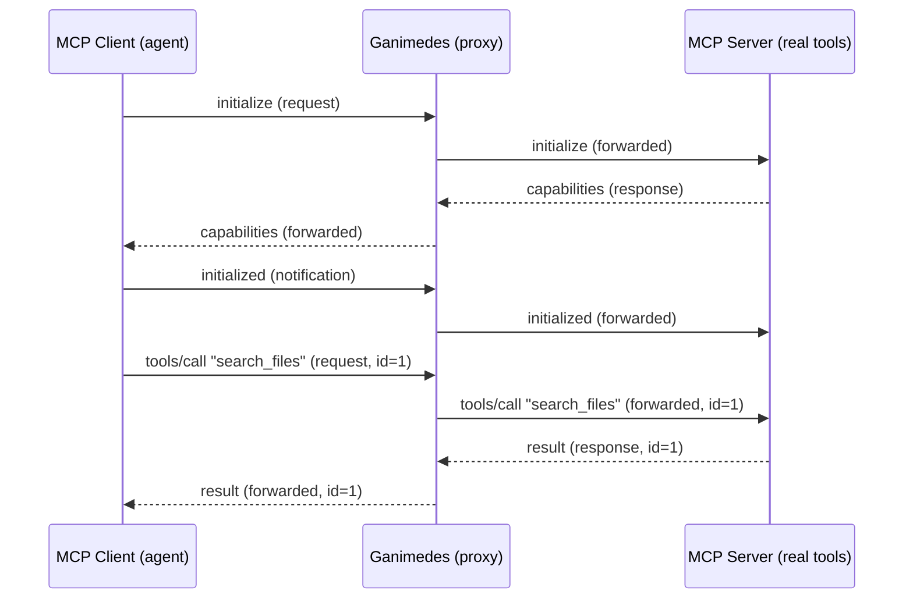
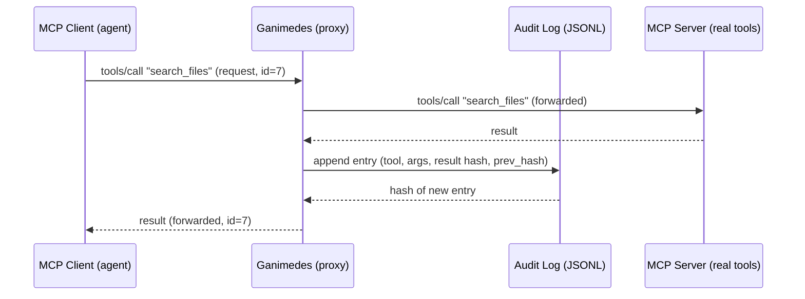
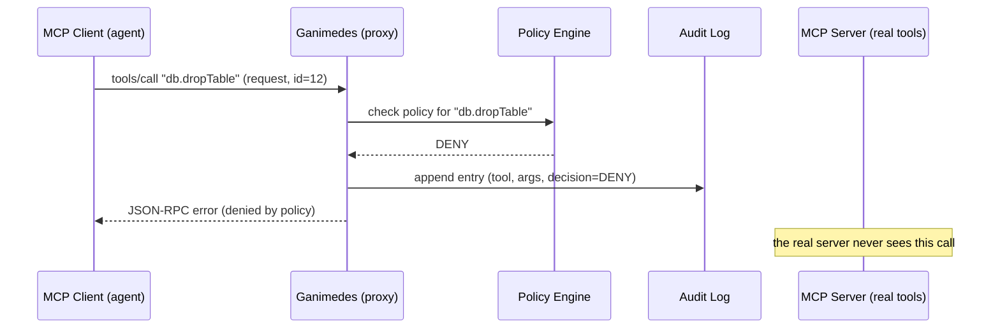
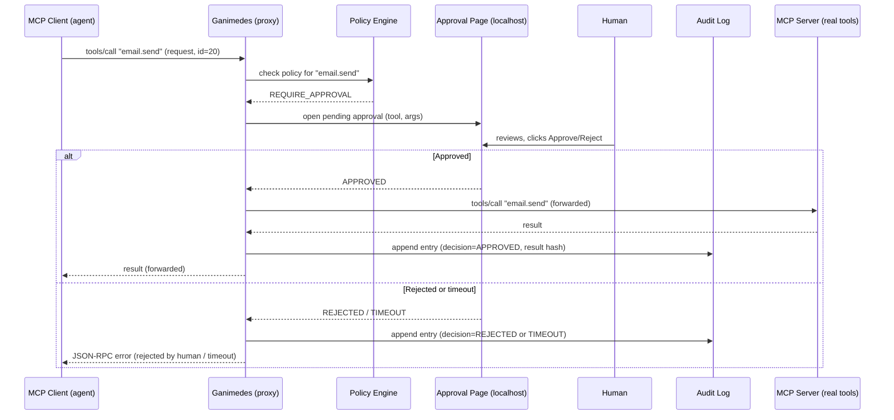

# Ganimedes - Sequence Diagrams

> Living document. Each diagram below is the runtime behavior spec for one
> milestone in the build order from [`DESIGN.md`](DESIGN.md#5-build-order).
> They are written in [Mermaid](https://mermaid.js.org/) `sequenceDiagram`
> syntax, which GitHub renders natively in markdown, so the diagrams stay
> plain text and diffable in git instead of drifting screenshots.

## 1. Transparent passthrough

The proxy forwards every message unchanged in both directions, including the
`initialize` handshake. To the client, Ganimedes looks exactly like the real
MCP server.

## 2. Audit log

Same passthrough, plus a side effect: every `tools/call` and its result are
appended to the hash-chained log. The client sees nothing different.

## 3. Deny-list

A denied call never reaches the real server. Ganimedes answers with a JSON-RPC
error directly and still records the attempt.

## 4. Human-in-the-loop

A flagged call pauses. A human reviews it on the local approval page. The
result branches on approve, reject, or timeout (timeout defaults to deny).

