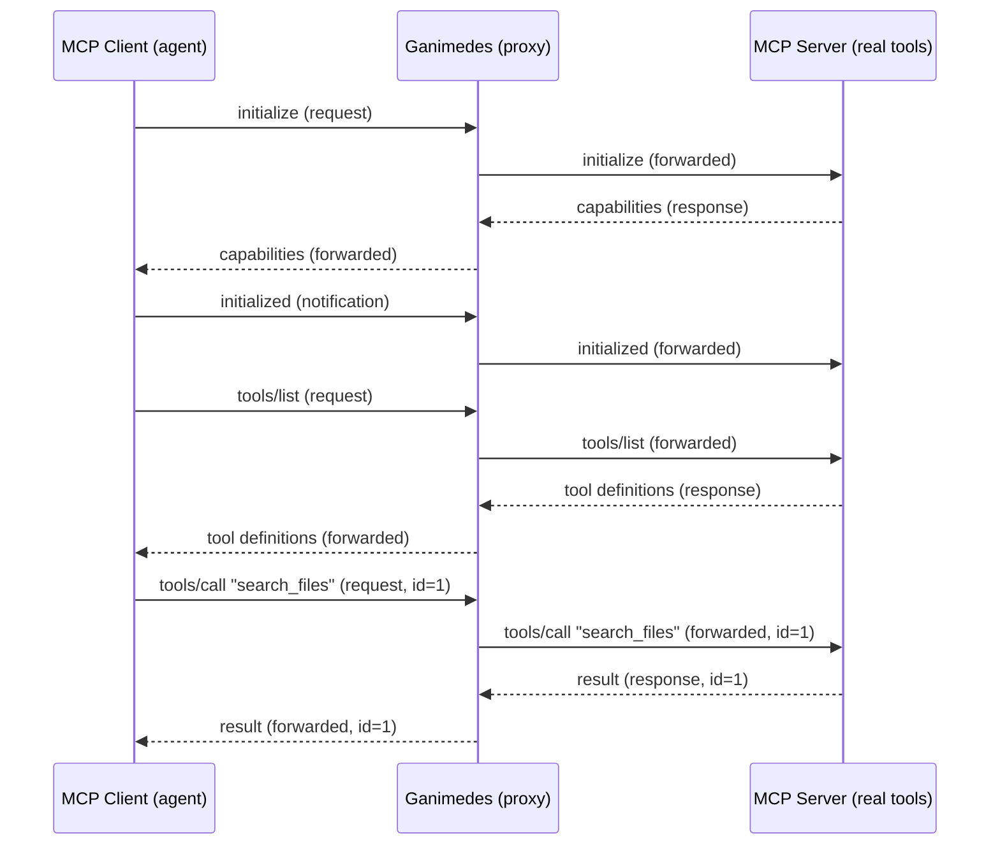
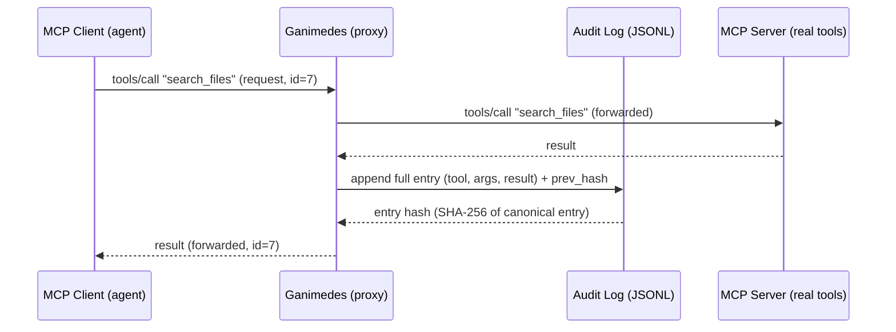
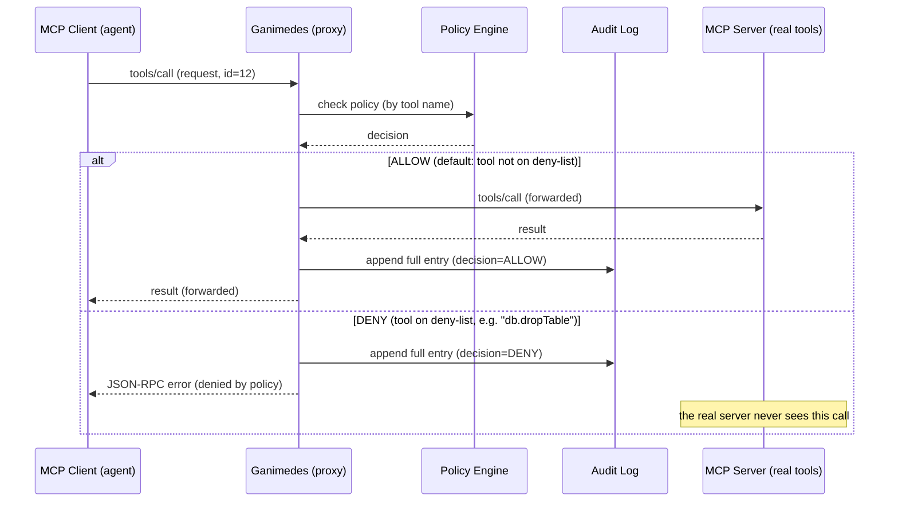
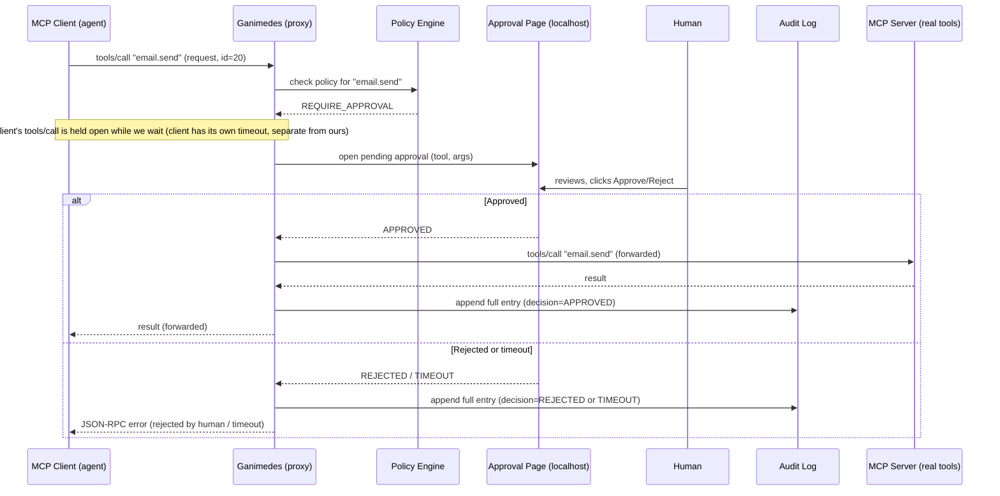

# Ganimedes - Sequence Diagrams

> Living document. Each diagram below is the runtime behavior spec for one
> milestone in the build order from [`DESIGN.md`](DESIGN.md#5-build-order).
> They are written in [Mermaid](https://mermaid.js.org/) `sequenceDiagram`
> syntax, which GitHub renders natively in markdown, so the diagrams stay
> plain text and diffable in git instead of drifting screenshots.

**Scope of interception:** Ganimedes only inspects `tools/call`. Every other
message (`initialize`, `tools/list`, `resources/*`, `prompts/*`, notifications)
and every error returned by the real server is pure passthrough, forwarded
unchanged. Policy is **default-allow**: only tools on the deny-list or the
approval-list are treated specially.

## 1. Transparent passthrough ✅ *(implemented in v0)*

The proxy forwards every message unchanged in both directions, including the
`initialize` handshake. To the client, Ganimedes looks exactly like the real
MCP server.

## 2. Audit log ✅ *(implemented in v0)*

Same passthrough, plus a side effect: every `tools/call` and its result are
appended to the hash-chained log. The client sees nothing different.

## 3. Deny-list ✅ *(implemented in v0)*

Policy is checked by tool name. An allowed call flows through like diagram 2;
a denied call never reaches the real server. Either way, Ganimedes records the
attempt. The denied call gets a JSON-RPC error (`code -32000`) synthesized by
Ganimedes; it is the one message on the client-facing stream that did not come
from the real server (the deliberate, documented policy exception to
Constitution Art. 1.3).

## 4. Human-in-the-loop ✅ *(implemented in v0)*

A flagged call pauses. A human reviews it on the local approval page. The
result branches on approve, reject, or timeout. The approval timeout is
configurable and fails closed (defaults to deny). A tool is flagged by putting
its name on the config's `approve` list; the page is served on a loopback address
(`--approval-addr`).

